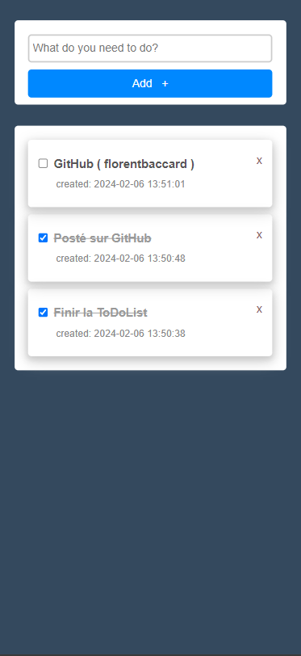

# 📝 To-Do List App

## Description

Cette application web permet à l'utilisateur de gérer une liste de tâches. L'utilisateur peut ajouter de nouvelles tâches, marquer les tâches comme complétées et supprimer les tâches existantes.

## Fonctionnalités

- Ajout de tâches : L'utilisateur peut saisir le titre d'une nouvelle tâche et l'ajouter à la liste en appuyant sur le bouton "Add".
- Marquage des tâches : L'utilisateur peut cliquer sur une case à cocher à côté de chaque tâche pour la marquer comme complétée. Les tâches complétées sont affichées avec une ligne barrée.
- Suppression de tâches : L'utilisateur peut supprimer une tâche en cliquant sur le bouton "x" à côté de la tâche.

## Structure du Projet

Le projet est organisé comme suit :

- `index.php` : Fichier principal de l'application contenant la structure HTML et le code PHP pour afficher et gérer les tâches.
- `db_conn.php` : Fichier de connexion à la base de données MySQL.
- `app/` : Répertoire contenant les scripts PHP pour ajouter, supprimer et marquer les tâches.
- `css/styles.css` : Fichier CSS pour le style de l'application.
- `js/script.js` : Fichier JavaScript pour la logique de l'application côté client.
- `img/` : Répertoire contenant les images utilisées dans l'application.

## Technologies Utilisées


## Installation

1. Clonez le dépôt :

```bash
git clone https://github.com/florentbaccard/ToDo_List_PHP.git
```

## Captures d'écran

<p align="center">
  
  
</p>
